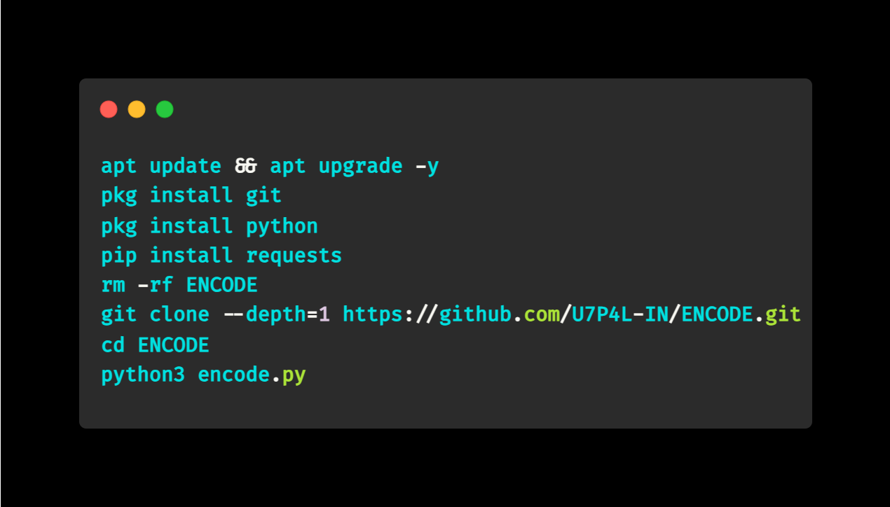
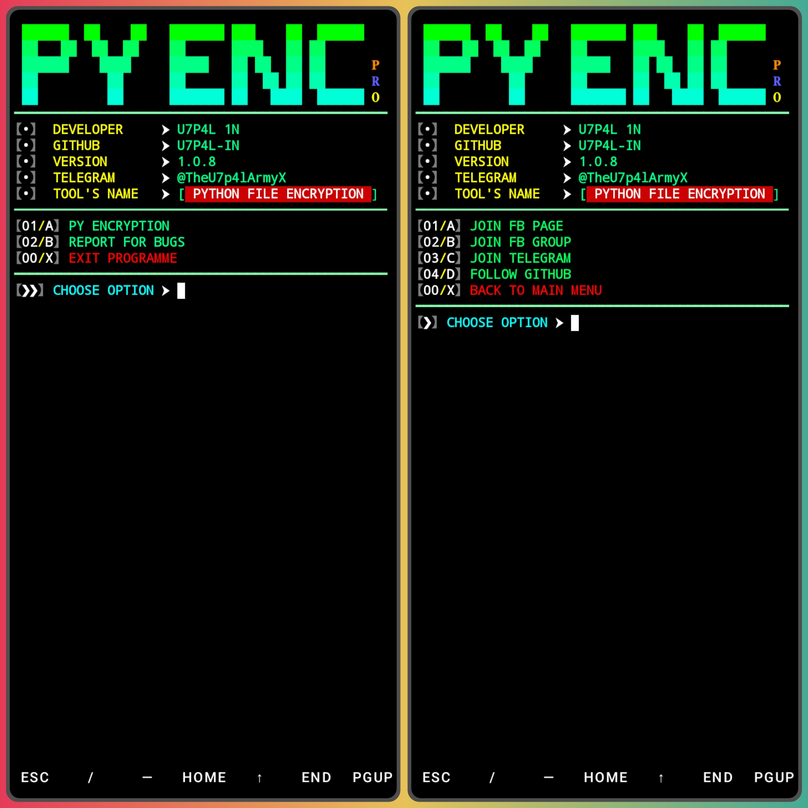
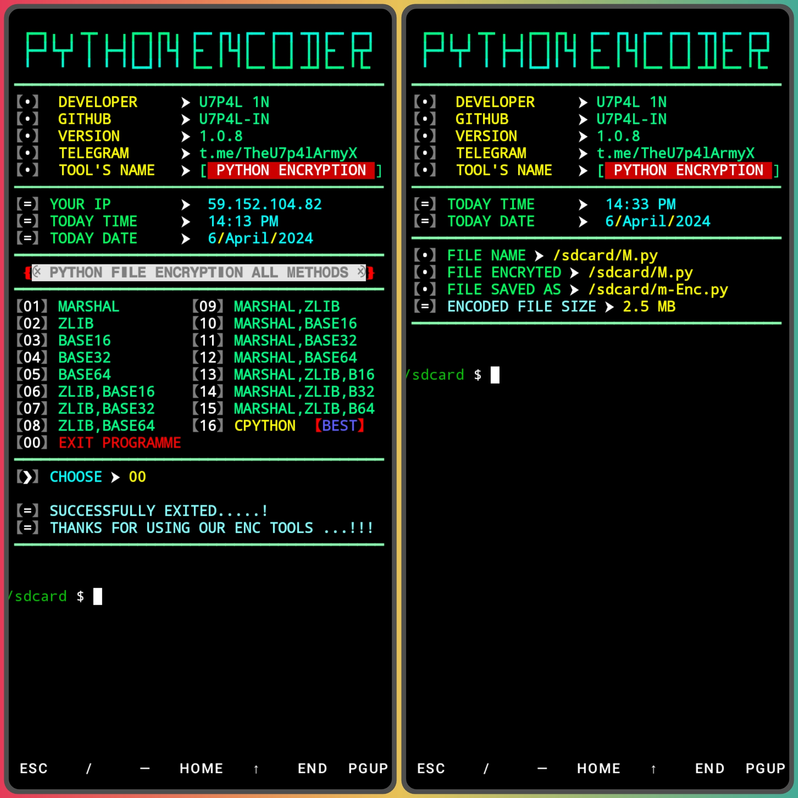
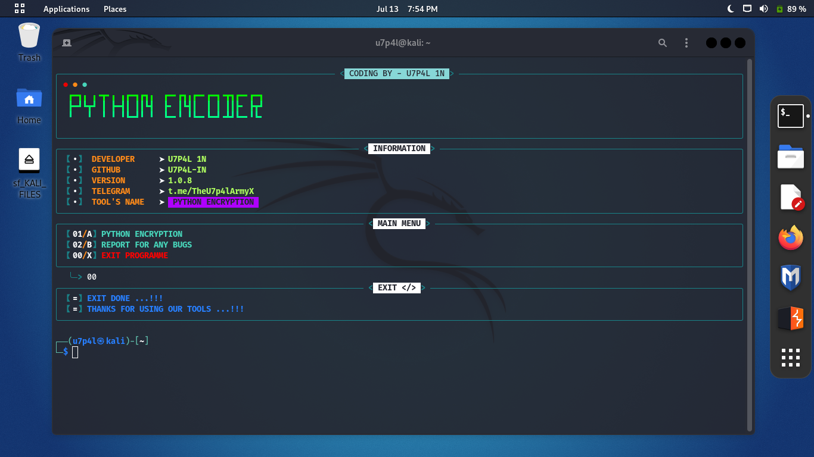
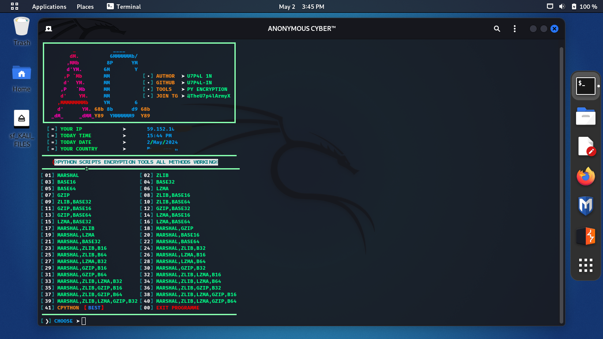
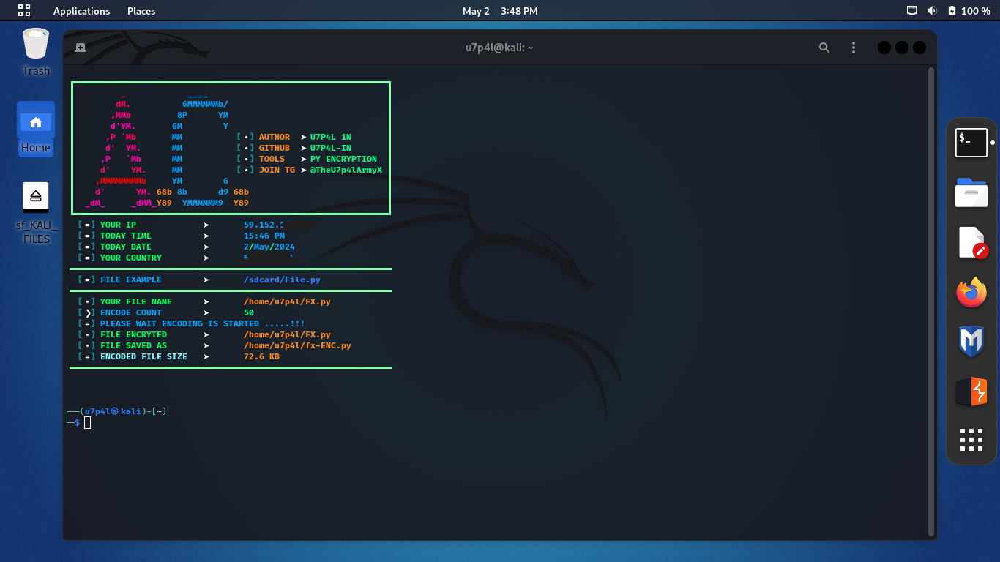

<p align="center">
</p>

</p>
   <p align="center">
      <a href="https://github.com/U7P4L-IN/ENCODE/stargazers">
      </a>
      <a href="https://github.com/U7P4L-IN/ENCODE/releases/latest">
      </a>
      <a href="https://www.conventionalcommits.org/en/v1.0.0/">
      </a>
      <a href="https://github.com/U7P4L-IN/ENCODE/actions/workflows/github-action.yml">
      </a>
   </p>
   
</br>

<h2 align="left">What is Python Encrypt ? > </h2><br>

> Python Encrypt is a tool that's help you to secure your important script. You can encrypt your script by this tool. And no one can stolen your script.

<br>
<h4 align="left">TESTED ON > </h4><br>

* Kali Linux
* Termux
* Mac os
* Ubuntu
* Perrot Sec OS

## Contributing
Feel Free To Clone This Project. For Major Changes, Please Open An Issue First To Discuss What You Would Like To Change Or Add, Thank You!!.


<h2 align="center">INSTALL TOOL ON TERMUX > </h2><br>
 
```python
apt update && apt upgrade -y
pkg install git
pkg install python
pip install requests
rm -rf ENCODE
git clone --depth=1 https://github.com/U7P4L-IN/ENCODE.git
cd ENCODE
python3 encode.py
```
<p align="center">

<h5 align="center"><b>TERMUX</b></h5>

<p align="center">
<p align="center";> 

<h5 align="center"><b>KALI LINUX</b></h5>
<p align="center">
<p align="center">  
    
### Result:
<p align="center">

### Tools Languages :

<p align="center">
</p>

# Report bugs
If you notice issues while installing this tool or running this tool kindly mail to me at <a href="mailto: lisame0007@gmail.com">Gmail</a> or Open an issue via github.

<h5 align="center"><b>DESCRIPTION</b></h5>

* ©️ Copyright Message
>> Copyright © [2023-27] [U7P4L-IN]
>All rights reserved. This Python project, along with its code, documentation, and any associated files, is the intellectual property of ANONYMOUS CYBER. You may not reproduce, distribute, or modify the contents of this repository without explicit permission from the owner.
# Give A Star ⭐

> You can also give this repository a star to show more people and they can use this repository.